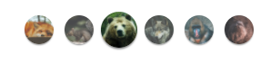
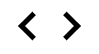

<div align="center" id="top"> 
  

  &#xa0;

</div>

<h1 align="center">Slide Web</h1>

<p align="center">
  

  

  

<hr>

<p align="center">
  <a href="#dart-sobre">Sobre</a> &#xa0; | &#xa0; 
  <a href="#sparkles-funcionalidades">Funcionalidades</a> &#xa0; | &#xa0;
  <a href="#white_check_mark-pré-requesitos">Pré requisitos</a> &#xa0; | &#xa0;
  <a href="#checkered_flag-começando">Começando</a> &#xa0; | &#xa0;
  <a href="#memo-licença">Licença</a> &#xa0; | &#xa0;
  <a href="https://github.com/weescoelho" target="_blank">Autor</a>
</p>

<br>

## :dart: Sobre ##

Este é um slider simples e bem otimizado para utilização em sites.

## :sparkles: Funcionalidades ##

:heavy_check_mark: Possibilidade de mudar as images arrastando com mouse ou touch;\
:heavy_check_mark: Mudança de imagens através das setas;\
:heavy_check_mark: Mudança de images através das thumbs;


## :white_check_mark: Pré requisitos ##

Antes de começar :checkered_flag:, você precisa ter o [Git](https://git-scm.com)  instalado em sua maquina.

## :checkered_flag: Começando ##

```bash
# Clone este repositório
$ git clone https://github.com/weescoelho/slide-web

```

## :rocket: Utilizando ## 

- Primeiro copie os arquivos slide.css e slide.js para seu projeto.

### Inicializando o projeto

```javascript
// Explicação de cada argumento.
const slide = new SlideNav([classe da lista de slides], [classe do container dos slides], [velocidade],[slide inicial]);

```

```javascript

// Código para inicialização do slider default.

import { SlideNav } from "./slide.js";

const slide = new SlideNav(".slide", ".slide-wrapper", 1.6, 2);
slide.init();

```

#### Para navegação por setas

```javascript
//Adicione essa linha ao projeto
slide.addArrow(".prev", ".next");
```

Você pode editar as classes para colocar setas customizadas.

#### Para navegação por thumbnail

```javascript
//Adicione essa linha ao projeto
slide.addControl('.custom-controls');
```


### HTML

- Coloque o HTML no seu projeto.
```html
  <ul class="custom-controls">
    <li></li>
      <li></li>
      <li></li>
      <li></li>
      <li></li>
      <li></li>
  </ul>
  <div class="slide-wrapper">
    <ul class="slide">
      <li></li>
      <li></li>
      <li></li>
      <li></li>
      <li></li>
      <li></li>   
    </ul>
  </div>
  <div class="arrow-nav">
    <button class="prev"></button>
    <button class="next"></button>
  </div>
```

#### Navegação por thumbs



```html
  <ul class="custom-controls">
    <li></li>
      <li></li>
      <li></li>
      <li></li>
      <li></li>
      <li></li>
  </ul>
```
Este bloco é para utilizar navegação por thumbnail. Você pode trocar as images a gosto, porem recomenda-se a utilização de images quadradas. 😉

#### Navegação por setas (botões)



```html
  <div class="arrow-nav">
    <button class="prev"></button>
    <button class="next"></button>
  </div>
```

Bloco responsável por adicionar os botões de navegação

## :memo: Licença ##

Feito com :heart: por <a href="https://github.com/weescoelho" target="_blank">Weslley Coelho</a>

&#xa0;

<a href="#top">Voltar para o topo</a>
